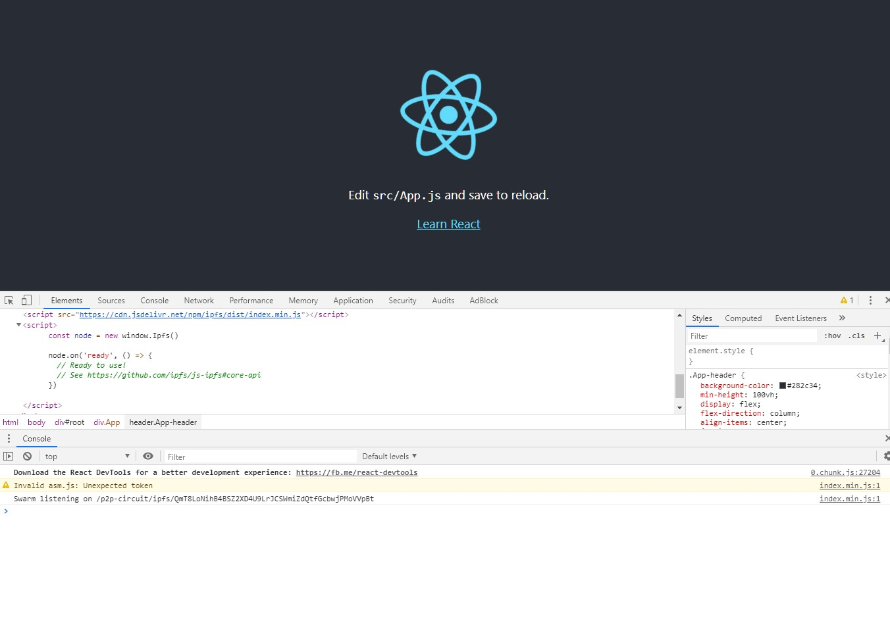

# IPFSjs with html file


## 1 | Description

Creats an IPFS peer to peer instance before the React app fully loads by inserting into `./client/public/index.html`.



## 2 | Getting Started

### 2.1 Install

Install dependencies for the React Client.

```
cd client
yarn || npm install
```


### 2.2 Run

Run the client. In `./client`:

```
yarn start || npm run start
```
